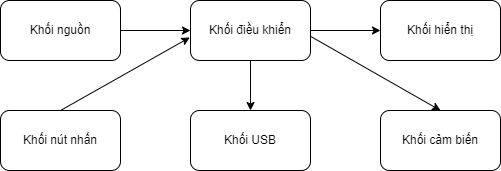

# Measure_current_circuit

## Table of Contents:
### 0. List of members implementing the project (Danh sách thành viên):

|STT|MSSV|Họ và tên|
|:---:|----|:---------:|
|1|2112173|Phạm Hồng My Sa|
|2|2213857|Võ Ngọc Tú|
|3|2211186|Lê Đăng Huy|
|4|2213561|Trịnh Thu Trang|

### 1. Specification
#### a. Description
Cường độ dòng điện định mức (I, đơn vị Ampe) là cường độ sẽ giúp cho thiết bị hoạt động với công suất cao nhất, nếu vượt quá giá trị định mức sẽ gây ra những hỏng hóc cho đồ dùng. Nhóm quyết định tìm hiểu và hiện thực mạch đo cường độ dòng điện của các thiết bị đơn giản. Kết quả đo được sẽ được hiển thị trên màn hình LCD và số liệu cũng sẽ được gửi đến máy tính.
#### b. Functionality
  - Mạch được thiết kế để đo lường và ghi lại cường độ dòng điện của thiết bị.
  - Có thể đo được nhiều thiết bị cùng lúc (bài làm này dựa trên mạch đo 4 thiết bị).
  - Kết quả đo được sẽ được hiển thị trên màn hình LCD.
  - Số liệu được truyền đến máy tính thông qua kết nối USB.
#### c. Characteristic
- Nguồn cung cấp: 12VDC – 3A.
- Mạch sử dụng hiệu điện thế vận hành là 5VDC.
- Nguồn đầu ra (từ khối nguồn): 5VDC.
- Vì quy mô mạch đơn giản, mạch dùng để đo các thiết bị có cường độ dòng điện nhỏ có cường độ dòng điện từ 0A đến 5A.
- Kích thước mạch: 120 (dài) x 90 (rộng) x 2 (dày) mm
#### d. Block diagram

- Khối cảm biến được xây dựng dựa trên Hall Effect Sensor, cảm biến được đặt trong mạch điện và tạo ra một tín hiệu điện áp khi dòng điện đi qua nó. Tín hiệu output sẽ được gửi đến khối điều khiển.
- Khối hiển thị: LCD để hiển thị giá trị cường độ dòng điện trực tiếp trên thiết bị.
- Khối nguồn: hỗ trợ xử lý nguồn không ổn định từ bên ngoài, từ đó cung cấp nguồn ổn định 5V cho toàn bộ mạch, được xây dựng dựa trên IC LM7805.
- Khối điều khiển (Microcontroller): điều khiển toàn bộ mạch, nhận tín hiệu từ cảm biến, xử lý tính toán cường độ dòng điện tương ứng và gửi tín hiệu đến LCD để hiển thị và USB để gửi lên máy tính. Nhóm sử dụng vi điều khiển có cấu trúc lấy ý tưởng từ bo mạch Arduino đã học, xây dựng dựa trên IC ATMEGA 16L.
- Khối USB: cổng USB dùng để hỗ trợ trong lập trình mạch điều khiển và truyền dữ liệu số đo CĐDĐ của các thiết bị đến máy tính.
- Khối nút nhấn: gồm nút nhấn Reset (khởi động lại) nhằm khởi động lại mạch khi có nhu cầu kết thúc trạng thái hiện tại, chuyển sang trạng thái mới.

### 2.	Hardware conceptual design
#### a. Form factor

#### b.	Hardware interface

### 3.	Implementation
#### a. Schematic
Sơ đồ nguyên lý của mạch được hiện thực bởi phần mềm Altium Designer.

#### b.	PCB
PCB của mạch được hiện thực bởi phần mềm Altium Designer.
- Trước khi phủ đồng:

- Sau khi phủ đồng:

Lớp top:

Lớp bottom:

#### b.	3D Body
Hình 3D của mạch được hiện thực bởi phần mềm Altium Designer.
- Mặt trên:

- Mặt dưới:

- Mặt nghiêng:

